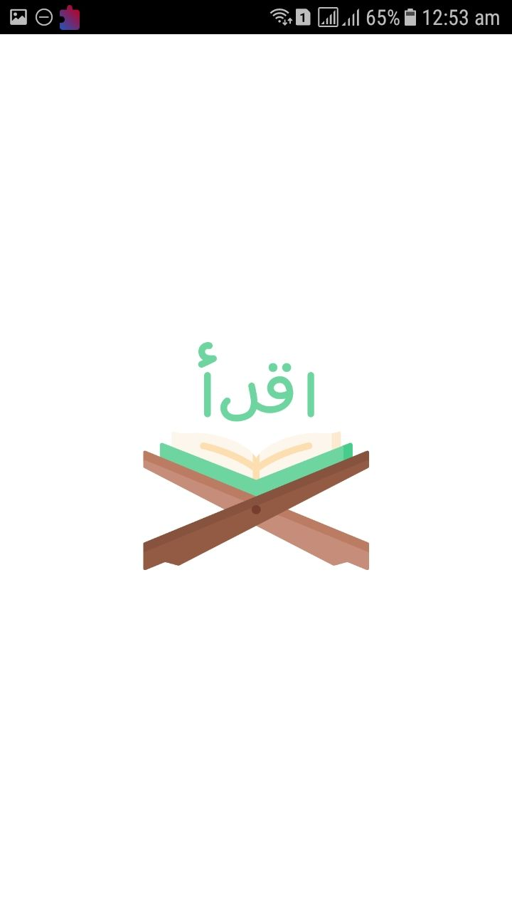
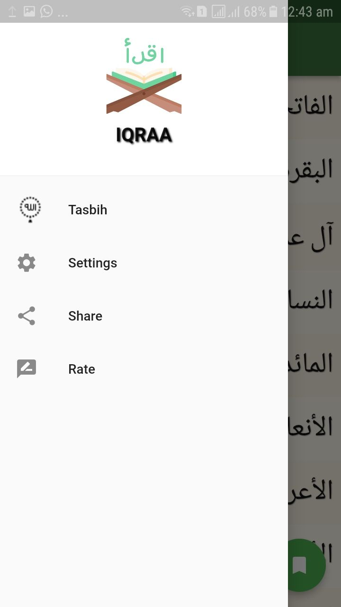

 

  

<h3 align="center">IQRAA</h3>

  

    IQRAA App shared local DB and Local Json
     
    <a href="https://github.com/mostafahassan8799/IQRAA_App"><strong>Explore the docs »</strong></a>
     
     
    <a href="https://github.com/mostafahassan8799/IQRAA_App">View Demo</a>
    ·
    <a href="https://github.com/mostafahassan8799/IQRAA_App">Report Bug</a>
    ·
    <a href="https://github.com/mostafahassan8799/IQRAA_App">Request Feature</a>
  

IQRAA app is open-source  app for Android & ios. It is built with Dart on top of Google's Flutter Framework.

     

<b>تطبيق أقرأ</b>

## Benfit👻
- [🖥] # Screens 🖥
- [🆗]  HomeScreen
- [🆗] Surah Screen
- [🆗] Tasbih Screen
- [🆗] Setting Screen
--------------------------------
- [🖥] # Deal With 🖥
- [x] Deal With Shared Prefs
- [x] Deal With rootBundle
- [x] Deal With local json 

------------------------------

## Snapshots

| Splash Screen | homw screen Screen                        |
|------|-------------------------------------------|
||  |

| drawer                                      | Tasbih  Page                                |
|---------------------------------------------|----------------------------------------------|
|  |  |

| View One                                     | View Two  Page                               |
|----------------------------------------------|----------------------------------------------|
|  |  |

